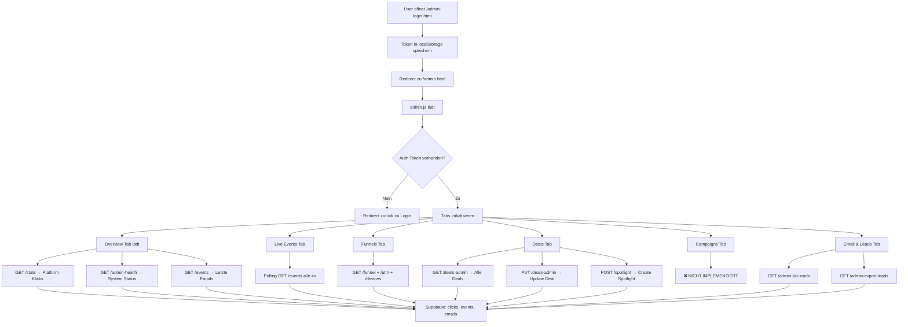
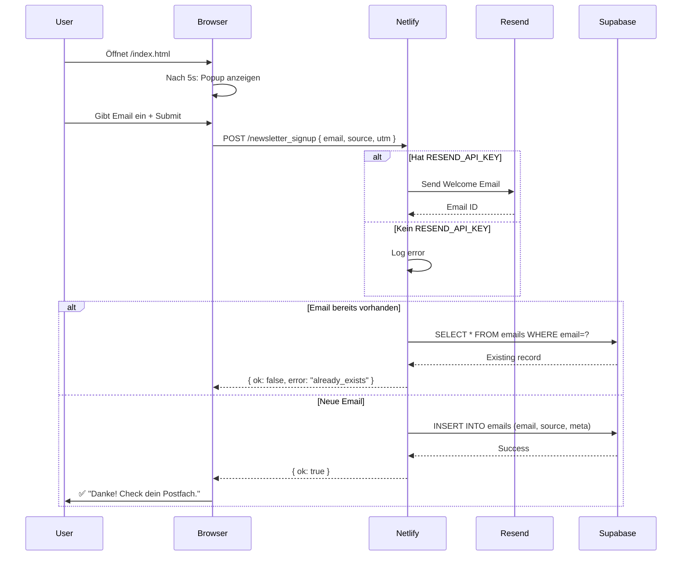
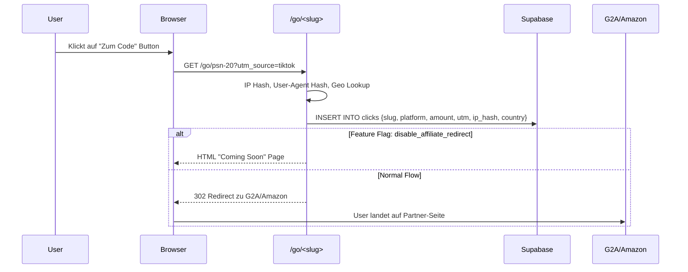

# DropCharge - Vollständige Architektur-Analyse & Implementierungsplan

**Erstellt:** 2026-02-21  
**Zweck:** Vollständiger Überblick über Admin UI, Public Site, Newsletter, API und Datenflüsse

---

## 📋 Inhaltsverzeichnis

1. [Entry Points & Dateien](#1-entry-points--dateien)
2. [Datenflüsse (UI → API → DB)](#2-datenflüsse-ui--api--db)
3. [Tote Buttons & Unverdrahtete UI-Elemente](#3-tote-buttons--unverdrahtete-ui-elemente)
4. [Implementierungsplan (5-8 Schritte)](#4-minimal-invasiver-implementierungsplan)
5. [Technische Details](#5-technische-details)

---

## 1. Entry Points & Dateien

### 1.1 HTML Entry Points

| Datei | Pfad | Zweck | Status |
|-------|------|-------|--------|
| **Public Landing** | `/index.html` | Marketing-Seite mit Deals, Newsletter-Popup, Live-Stats | ✅ Vollständig |
| **Admin Dashboard** | `/admin.html` | Umfassendes Control Panel mit 8 Tabs | ⚠️ 90% fertig |
| **Admin Login** | `/admin-login.html` | Token-basierter Login (localStorage) | ✅ Vollständig |

### 1.2 Netlify Functions (API Endpoints)

#### **Öffentliche APIs (7)**

```
GET  /.netlify/functions/activity           → Live-Klicks (30 Min) + Top Deal
GET  /.netlify/functions/spotlight          → Aktueller Game Spotlight
GET  /.netlify/functions/public-config      → TikTok Pixel ID, Affiliate Links
POST /.netlify/functions/track-event        → Event-Tracking (ViewContent, ScrollDepth)
POST /.netlify/functions/newsletter_signup  → Newsletter-Anmeldung (via Resend API)
POST /.netlify/functions/subscribe          → Alternative Newsletter API (Supabase only)
POST /.netlify/functions/unsubscribe        → Newsletter-Abmeldung
GET  /go/<slug>                            → Affiliate-Redirect + Click-Tracking
```

#### **Admin Analytics APIs (8)**

```
GET  /.netlify/functions/stats              → Platform-Klicks, Emails, Amounts
GET  /.netlify/functions/admin-health       → System Health (Auth, Supabase, Schema)
GET  /.netlify/functions/events             → Raw Event Logs für Live Dashboard
GET  /.netlify/functions/funnel             → Conversion-Funnel (Landing→Deal→Email)
GET  /.netlify/functions/utm                → UTM-Parameter Analytics
GET  /.netlify/functions/devices            → Device/Browser/Geo Breakdown
GET  /.netlify/functions/api-activity       → Activity Stats per Deal Slug
GET  /.netlify/functions/last-activity      → Timestamp letzter Klick
```

#### **Admin Deal Management APIs (3)**

```
GET  /.netlify/functions/deals-admin        → Liste aller Deals + Metriken
PUT  /.netlify/functions/deals-admin        → Inline-Update (Priority, Active Status)
GET  /.netlify/functions/spotlight          → Current Spotlight (public)
POST /.netlify/functions/spotlight          → Create/Update Spotlight (admin)
POST /.netlify/functions/affiliate-factory  → Generate /go/ Affiliate Links
```

#### **Admin Tools & Data APIs (4)**

```
POST /.netlify/functions/admin-seed         → Test-Daten generieren (Clicks, Emails, Events)
GET  /.netlify/functions/admin-list-leads   → Email-Subscriber mit Filtern
GET  /.netlify/functions/admin-export-leads → CSV Export von Leads
POST /.netlify/functions/optimize-deals     → Auto-Optimization (CTR-basiert)
GET  /.netlify/functions/settings           → Feature Flags lesen
PUT  /.netlify/functions/settings           → Feature Flags setzen
```

#### **❌ FEHLENDE Campaign APIs (4)**

```
POST /.netlify/functions/admin-campaign-send     → NICHT IMPLEMENTIERT
POST /.netlify/functions/admin-campaign-create   → NICHT IMPLEMENTIERT
POST /.netlify/functions/admin-campaign-cancel   → NICHT IMPLEMENTIERT
POST /.netlify/functions/admin-campaign-tick     → NICHT IMPLEMENTIERT
```

### 1.3 Config-Dateien & Umgebungsvariablen

#### **Netlify-Config**
- **Datei:** `/netlify.toml`
- **Inhalt:** Redirects, Security Headers, CSP, Functions Directory

#### **Erforderliche Environment Variables**

```bash
# Supabase (erforderlich)
SUPABASE_URL=https://xyz.supabase.co
SUPABASE_SERVICE_KEY=eyJhbGciOiJIUzI1NiIsInR5cCI6IkpXVCJ9...

# Admin Auth (optional, aber empfohlen)
ADMIN_PASSWORD_HASH=<bcrypt hash via scripts/hash-password.js>

# Email Service (optional für Newsletter)
RESEND_API_KEY=re_...

# TikTok Tracking (optional)
TIKTOK_PIXEL_ID=TT-XXXXXXXX

# Feature Flags (optional)
ENABLE_DOUBLE_OPT_IN=1
```

#### **Public Config**
- **Datei:** `/config.json`
- **Verwendung:** Lädt dynamisch TikTok Pixel ID + Affiliate Links
- **Fallback:** `window.__CONFIG__` inline

---

## 2. Datenflüsse (UI → API → DB)

### 2.1 Public Landing Page Flow

```mermaid
graph TB
    A[User besucht /index.html] --> B{Aktion?}
    B -->|Page Load| C[Track: ViewContent]
    B -->|15s on page| D[Track: TimeOnPage15s]
    B -->|Scrollt 60%| E[Track: ScrollDepth]
    B -->|Klickt Deal Button| F[/go/slug Redirect]
    B -->|Öffnet Newsletter Popup| G[Email-Form anzeigen]
    
    C --> H[POST /track-event]
    D --> H
    E --> H
    H --> I[Supabase: events Table]
    
    F --> J[GET /go/slug]
    J --> K[Log zu Supabase: clicks Table]
    J --> L[302 Redirect zu Affiliate URL]
    
    G --> M{User trägt Email ein}
    M -->|Submit| N[POST /newsletter_signup]
    N --> O{Hat RESEND_API_KEY?}
    O -->|Ja| P[Resend Email API]
    O -->|Nein| Q[Fallback: POST /subscribe]
    Q --> R[Supabase: emails Table]
    P --> R
```

### 2.2 Admin Dashboard Flow



### 2.3 Newsletter Signup Detailed Flow



### 2.4 Affiliate Click Tracking Flow



---

## 3. Tote Buttons & Unverdrahtete UI-Elemente

### 3.1 🔴 KRITISCH: Campaign Management System

**Dateien:** `/admin.html` (Zeilen 225-265), `/assets/admin.js` (Zeilen 22-27)

#### **Problem:**
Alle Campaign-Funktionen sind im UI vorhanden, aber **Backend fehlt komplett**.

#### **Betroffene UI-Elemente:**

| Element | ID/Selector | Zeile in admin.html | Zeile in admin.js | Status |
|---------|-------------|---------------------|-------------------|--------|
| Campaign Form | `#campaign-form` | 236 | Handler fehlt | ❌ DEAD |
| "Test senden" Button | `#campaign-test` | 243 | Handler fehlt | ❌ DEAD |
| "An alle senden" Submit | `#campaign-form submit` | 244 | Handler fehlt | ❌ DEAD |
| Preview aktualisieren | `#campaign-preview-refresh` | 252 | ✅ renderPreview() | ✅ OK |
| Campaign Log | `#campaign-log` | 262 | loadCampaignLog() fehlt | ❌ DEAD |
| Log Refresh | `#campaign-log-refresh` | 260 | loadCampaignLog() fehlt | ❌ DEAD |

#### **Fehlende Implementierungen:**

**In `/assets/admin.js`:**
```javascript
// Zeile 22-27: API Endpoints deklariert aber nicht existent
campaignSend: `${API_BASE}/.netlify/functions/admin-campaign-send`,        // ❌ Fehlt
campaignCreate: `${API_BASE}/.netlify/functions/admin-campaign-create`,    // ❌ Fehlt
campaignCancel: `${API_BASE}/.netlify/functions/admin-campaign-cancel`,    // ❌ Fehlt
campaignTick: `${API_BASE}/.netlify/functions/admin-campaign-tick`,        // ❌ Fehlt

// Event Listeners registriert aber Functions fehlen:
dom.campaignForm.addEventListener('submit', submitCampaign);               // ❌ submitCampaign() NICHT definiert
dom.campaignTest.addEventListener('click', sendCampaignTest);              // ❌ sendCampaignTest() NICHT definiert
dom.campaignLogRefresh.addEventListener('click', () => loadCampaignLog()); // ❌ loadCampaignLog() NICHT definiert
```

**Fehlende Netlify Functions:**
- `/netlify/functions/admin-campaign-send.js` ❌
- `/netlify/functions/admin-campaign-create.js` ❌
- `/netlify/functions/admin-campaign-cancel.js` ❌
- `/netlify/functions/admin-campaign-tick.js` ❌

**Datenbank-Support:**
```sql
-- Tabellen EXISTIEREN bereits in supabase-schema.sql:
✅ newsletter_campaigns (id, subject, body_html, status, total_recipients, sent_count)
✅ newsletter_sends (campaign_id, subscriber_id, email, status, sent_at)
✅ newsletter_subscribers (email, status, source, utm_*, last_sent_at)
```

#### **User Impact:**
Admin sieht komplettes Campaign-Interface, aber beim Versuch eine Kampagne zu senden:
1. Button-Click → JavaScript Error (submitCampaign is not defined)
2. Console zeigt: `Uncaught ReferenceError: submitCampaign is not defined`
3. Kein Feedback, keine Error Message im UI

---

### 3.2 ⚠️ A/B Tests Tab

**Datei:** `/admin.html` (Zeilen 201-222)

#### **Problem:**
"Experiment anlegen" Button existiert, aber keine Implementierung.

| Element | ID | Zeile | Handler | Status |
|---------|-----|-------|---------|--------|
| "Experiment anlegen" Button | `#experiment-add` | 209 | ❌ Kein Event Listener | DEAD |
| Experiment Table | `#experiment-table` | 211 | ❌ Keine Load-Funktion | DEAD |

#### **Fehlende Implementierungen:**
- Kein Event Listener für `#experiment-add`
- Keine Supabase-Tabelle für Experimente
- Keine API-Funktion

**Impact:** Geringfügig – Tab ist sichtbar leer, aber offensichtlich "Work in Progress"

---

### 3.3 ⚠️ Export CSV (Quick Actions)

**Datei:** `/admin.html` (Zeile 46), `/assets/admin.js` (Zeile 96)

| Element | ID | Handler | Status |
|---------|-----|---------|--------|
| "Export CSV" Button | `#export-csv` | ✅ exportSubscribers() | ⚠️ Unklar ob vollständig |

**Analyse:**
- Button hat Event Listener: `dom.quickExport.addEventListener('click', exportSubscribers);`
- Function `exportSubscribers()` ist definiert
- Aber: Verweist möglicherweise nur auf Email-Export, nicht auf alle Daten

**Impact:** Gering – Funktion existiert, aber Scope unklar

---

### 3.4 ✅ Funktionsfähige UI-Elemente (Vollständigkeit)

**Public Landing (`/index.html`):**
- ✅ Alle Deal-Buttons (`/go/psn-*`, `/go/xbox-*`, `/go/nintendo-*`)
- ✅ Newsletter Popup Form
- ✅ Live Activity Counters
- ✅ Spotlight Card Auto-Load

**Admin Dashboard (`/admin.html`):**
- ✅ Overview Tab: Platform Stats, Health Check, Email Table
- ✅ Live Events Tab: Event Stream, Filters, Session Focus
- ✅ Funnels Tab: Conversion Funnel, UTM Lists, Device Grid
- ✅ Deals Tab: Deal Management, Spotlight Form, Optimizer
- ✅ Email & Leads Tab: Subscriber List, Export, Seed Generator
- ✅ Settings Tab: Feature Flags, Banner Message

---

## 4. Minimal-Invasiver Implementierungsplan

**Ziel:** Deals CRUD + Newsletter Signup + Basic Analytics + Campaign System komplett funktionsfähig machen

### Phase 1: Newsletter & Tracking Fix (Bereits ✅)

**Status:** Vollständig implementiert
- Newsletter Popup funktioniert
- Email wird in Supabase gespeichert
- Event Tracking läuft

### Phase 2: Deals CRUD (Bereits ✅)

**Status:** Vollständig implementiert
- `/netlify/functions/deals-admin.js` → CRUD für Spotlights
- Admin UI kann Deals erstellen, bearbeiten, aktivieren/deaktivieren
- Affiliate Factory generiert /go/ Links

### Phase 3: Basic Analytics (Bereits ✅)

**Status:** Vollständig implementiert
- Live Events Stream
- Funnel Analytics
- UTM Tracking
- Device/Geo Breakdown

---

### 🎯 Phase 4: Campaign System Implementierung (HAUPTAUFGABE)

**Dateien zu erstellen:**

#### Schritt 1: Backend Functions erstellen

**Datei 1:** `/netlify/functions/admin-campaigns.js`
```javascript
// GET: Liste aller Kampagnen
// Returns: { campaigns: [...], total: N }
```

**Datei 2:** `/netlify/functions/admin-campaign-create.js`
```javascript
// POST: Erstelle neue Kampagne
// Body: { subject, body_html, segment, test_email? }
// Returns: { ok: true, campaign_id }
```

**Datei 3:** `/netlify/functions/admin-campaign-send.js`
```javascript
// POST: Sende Kampagne an Audience
// Body: { campaign_id, test_mode: false }
// Logic:
//   1. Lade Subscriber (filter by segment)
//   2. Erstelle newsletter_sends Einträge
//   3. Sende Emails via Resend API (batched)
//   4. Update campaign status
```

**Datei 4:** `/netlify/functions/admin-campaign-test.js`
```javascript
// POST: Test-Email senden
// Body: { subject, body_html, test_email }
// Returns: { ok: true, message_id }
```

#### Schritt 2: Frontend Functions ergänzen (`/assets/admin.js`)

**Zeile ~1200+ (nach loadCampaigns):**

```javascript
async function submitCampaign(event) {
  event.preventDefault();
  const formData = new FormData(dom.campaignForm);
  const payload = {
    subject: formData.get('subject'),
    body_html: formData.get('html'),
    segment: formData.get('segment') || null
  };
  
  try {
    const res = await fetch(API.campaignCreate, {
      method: 'POST',
      headers: { 'Content-Type': 'application/json', 'x-admin-token': getToken() },
      body: JSON.stringify(payload)
    });
    const data = await res.json();
    if (!res.ok || !data.ok) throw new Error(data.error || 'Failed');
    
    // Sende Kampagne
    const sendRes = await fetch(API.campaignSend, {
      method: 'POST',
      headers: { 'Content-Type': 'application/json', 'x-admin-token': getToken() },
      body: JSON.stringify({ campaign_id: data.campaign_id })
    });
    const sendData = await sendRes.json();
    if (!sendRes.ok || !sendData.ok) throw new Error(sendData.error || 'Send failed');
    
    showToast('✅ Kampagne gesendet!');
    dom.campaignForm.reset();
    loadCampaignLog();
  } catch (err) {
    console.error('submitCampaign error', err);
    showToast('❌ ' + err.message, 'error');
  }
}

async function sendCampaignTest(event) {
  event.preventDefault();
  const formData = new FormData(dom.campaignForm);
  const testEmail = formData.get('testEmail');
  if (!testEmail) {
    showToast('⚠️ Test-Email fehlt', 'warning');
    return;
  }
  
  const payload = {
    subject: formData.get('subject'),
    body_html: formData.get('html'),
    test_email: testEmail
  };
  
  try {
    const res = await fetch(API.campaignTest, {
      method: 'POST',
      headers: { 'Content-Type': 'application/json', 'x-admin-token': getToken() },
      body: JSON.stringify(payload)
    });
    const data = await res.json();
    if (!res.ok || !data.ok) throw new Error(data.error || 'Test failed');
    showToast('✅ Test-Email gesendet!');
  } catch (err) {
    console.error('sendCampaignTest error', err);
    showToast('❌ ' + err.message, 'error');
  }
}

async function loadCampaignLog({ silent = false } = {}) {
  try {
    const res = await fetch(API.campaigns + '?limit=10', {
      headers: { 'x-admin-token': getToken() }
    });
    if (!res.ok) throw new Error('Failed to load campaigns');
    const data = await res.json();
    renderCampaignLog(data.campaigns || []);
  } catch (err) {
    console.error('loadCampaignLog error', err);
    if (!silent) showToast('❌ Kampagnen laden fehlgeschlagen', 'error');
  }
}

function renderCampaignLog(campaigns) {
  if (!campaigns.length) {
    dom.campaignLog.innerHTML = '<p class="empty">Noch keine Kampagnen gesendet.</p>';
    return;
  }
  const html = campaigns.map(c => `
    <div class="campaign-log-item">
      <strong>${c.subject}</strong>
      <span>Status: ${c.status}</span>
      <span>Sent: ${c.sent_count || 0}/${c.total_recipients || 0}</span>
      <span>${new Date(c.created_at).toLocaleString('de-DE')}</span>
    </div>
  `).join('');
  dom.campaignLog.innerHTML = html;
}
```

#### Schritt 3: API Endpoint in admin.js aktualisieren

**Zeile ~22-27:**
```javascript
campaignTest: `${API_BASE}/.netlify/functions/admin-campaign-test`,   // Neu hinzufügen
```

#### Schritt 4: Testing

1. Admin einloggen
2. Zu "Campaigns" Tab navigieren
3. Test-Kampagne erstellen:
   - Subject: "Test Newsletter"
   - HTML: `<h1>Hallo!</h1><p>Das ist ein Test.</p>`
   - Test Email: `test@example.com`
4. "Test senden" klicken → Email sollte ankommen
5. "An alle senden" klicken → Kampagne sollte an alle Active Subscribers gehen

---

### 🎯 Phase 5: A/B Tests (Optional)

**Scope:** Niedrige Priorität, kann nach Launch ergänzt werden

**Erforderlich:**
1. Supabase Tabelle: `experiments (id, name, variant_a, variant_b, traffic_split, status)`
2. Netlify Function: `admin-experiments.js` (CRUD)
3. Event Listener in `admin.js` für `#experiment-add`

**Zeitaufwand:** ~2-3 Stunden

---

### 🎯 Phase 6: Polish & Validation

**Checklist:**
- [ ] Alle Newsletter-Signups testen (Index + Admin)
- [ ] Deal-Links testen (/go/*)
- [ ] Campaign Test-Email verschicken
- [ ] Campaign an 1 Test-Subscriber senden
- [ ] Optimizer-Run testen
- [ ] CSV Export testen
- [ ] Health Check validieren

---

## 5. Technische Details

### 5.1 Datenbank Schema (Supabase)

**Bestehende Tabellen:**

```sql
✅ clicks (id, slug, platform, amount, utm_*, country, ip_hash, created_at)
✅ events (id, type, name, slug, utm_*, session_id, meta, created_at)
✅ emails (id, email, confirmed, source, meta, created_at)
✅ spotlights (id, title, slug, platform, price, affiliate_url, active, priority)
✅ settings (key, value, updated_at)
✅ newsletter_subscribers (id, email, status, utm_*, last_sent_at)
✅ newsletter_campaigns (id, subject, body_html, status, total_recipients, sent_count)
✅ newsletter_sends (campaign_id, subscriber_id, email, status, sent_at)
✅ admin_sessions (token, ip, expires_at)
✅ admin_login_attempts (ip, created_at)
✅ admin_audit_log (event, payload, created_at)
```

**Fehlende Tabellen:**
- `experiments` (für A/B Tests) ⚠️

### 5.2 Authentication Flow

**Admin Auth:**
1. User gibt Token in `/admin-login.html` ein
2. Token wird in `localStorage.setItem('admin_token', ...)` gespeichert
3. `admin.js` liest Token und sendet in Header: `x-admin-token: <token>`
4. Backend validiert via `requireAdmin()` Helper (`_lib/admin-token.js`)

**Public:**
- Keine Auth erforderlich
- Rate Limiting via IP-basierte `admin_login_attempts` Tabelle

### 5.3 Deployment Workflow

**Development:**
```bash
npm install
npx netlify dev
```

**Production:**
```bash
git push origin main
# Auto-Deploy via Netlify Git Integration
```

**Environment Variables setzen:**
1. Netlify Dashboard → Site Settings → Environment Variables
2. Erforderlich: `SUPABASE_URL`, `SUPABASE_SERVICE_KEY`
3. Optional: `ADMIN_PASSWORD_HASH`, `RESEND_API_KEY`, `TIKTOK_PIXEL_ID`

---

## 📊 Zusammenfassung

### Was funktioniert ✅
- **Public Landing:** Vollständig (Deals, Newsletter, Tracking)
- **Admin Analytics:** Vollständig (Stats, Events, Funnels, UTM, Devices)
- **Deal Management:** Vollständig (CRUD, Optimizer, Factory)
- **Email Leads:** Vollständig (List, Export, Seed Data)
- **Settings:** Vollständig (Feature Flags, Config)

### Was fehlt ❌
- **Campaign System:** 0% implementiert (UI existiert, Backend fehlt)
  - 4 Netlify Functions fehlen
  - 3 JavaScript Functions fehlen
  - Event Listeners registriert aber brechen
  
- **A/B Tests:** 0% implementiert (Placeholder UI)
  - Keine Tabelle
  - Keine API
  - Kein Event Handler

### Priorität für Launch

| Feature | Status | Für MVP erforderlich? | Aufwand |
|---------|--------|----------------------|---------|
| Deals CRUD | ✅ Done | ✅ Ja | — |
| Newsletter Signup | ✅ Done | ✅ Ja | — |
| Basic Analytics | ✅ Done | ✅ Ja | — |
| **Campaign System** | ❌ Missing | ⚠️ **Optional** | ~8-12h |
| A/B Tests | ❌ Missing | ❌ Nein | ~2-3h |

---

## 📁 Datei-Referenz

### Kritische Dateien (müssen funktionieren)

```
/index.html                                 ✅ Public Landing
/admin.html                                 ⚠️ 90% fertig (Campaign fehlt)
/admin-login.html                           ✅ Login
/assets/app.js                              ✅ Public JS
/assets/admin.js                            ⚠️ Campaign Functions fehlen
/netlify/functions/go.js                    ✅ Affiliate Redirect
/netlify/functions/newsletter_signup.js     ✅ Newsletter API
/netlify/functions/subscribe.js             ✅ Fallback Newsletter
/netlify/functions/deals-admin.js           ✅ Deal CRUD
/netlify/functions/spotlight.js             ✅ Spotlight CRUD
/netlify/functions/stats.js                 ✅ Analytics
/netlify/functions/admin-health.js          ✅ Health Check
```

### Fehlende Dateien (zu erstellen)

```
/netlify/functions/admin-campaigns.js        ❌ Kampagnen-Liste
/netlify/functions/admin-campaign-create.js  ❌ Kampagne erstellen
/netlify/functions/admin-campaign-send.js    ❌ Kampagne senden
/netlify/functions/admin-campaign-test.js    ❌ Test-Email
```

---

## 🚀 Nächste Schritte

1. **Entscheidung:** Campaign System für MVP erforderlich?
   - **JA** → Implementiere Phase 4 (8-12h Arbeit)
   - **NEIN** → Deaktiviere Campaign Tab im Admin UI

2. **Quick Fix (wenn NEIN):**
   ```javascript
   // In /assets/admin.js, Zeile ~64:
   const hiddenTabs = ['campaigns', 'ab'];
   hiddenTabs.forEach(id => {
     const tab = document.querySelector(`[data-tab="${id}"]`);
     if (tab) tab.style.display = 'none';
   });
   ```

3. **Testing:** Vollständiger E2E Test aller funktionierenden Features

4. **Launch:** Deployment mit aktiven ENV vars

---

**Ende der Analyse**
